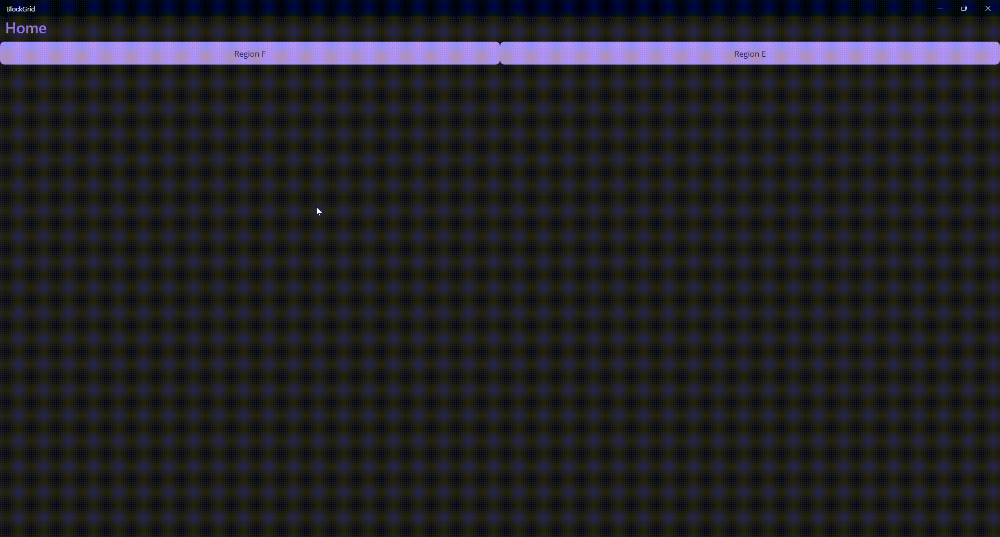
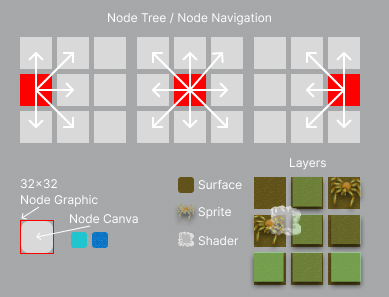
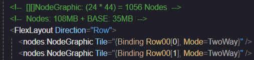
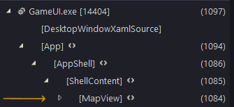

# NET MAUI / 2D Game Test

#### Memória:
- [x] Encontrar uma solução para renderizar os Nodes com a menor quantidade de memoria;
- [x] Manter uma quantidade estável de memória, e garantir que a aplicação esteja usando o GC;

> No início dos testes, utilizei o CollectionView, mas o consumo de memória foi excessivo e houve uma sobrecarga significativa para cada Node. Inicialmente, pensei que essa seria a melhor abordagem para lidar com nodes dinâmicos, mas encontrei uma solução mais eficiente e simples: definir todos os nodes necessários diretamente no XAML e usar eventos globais para enviar pacotes de dados com o tipo de superfície(Tile). Dessa forma, ganho desempenho na compilação e evito o desperdício de memória e objetos.

#### Componente:
- [x] Criar um componente simples e reutilizável com a menor sobrecarga (IGraphicsView, IDrawable);
- [x] Utilizar composição para separar as responsabilidades do componente (NodeGraphic, NodeCanva, NodeNavigation);
